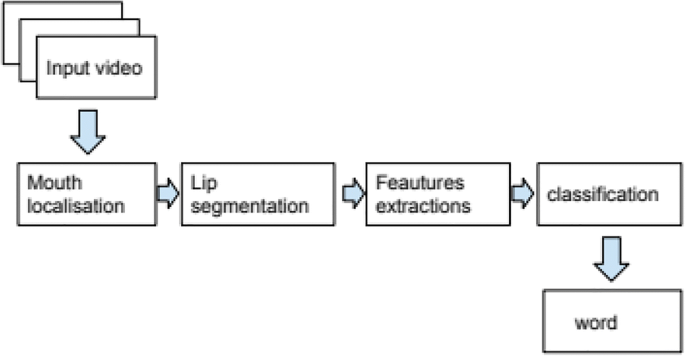
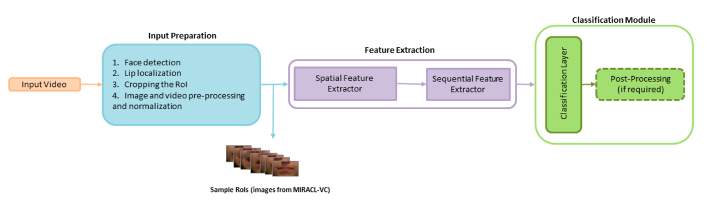

## Abstract:
In the wake of transformative advancements in deep learning methodologies and 
the proliferation of extensive datasets, the field of Visual Speech Recognition 
(VSR) has experienced a paradigm shift. Originally conceived to augment the 
accuracy of Audio Speech Recognition systems, VSR has evolved into a multifaceted 
technology with diverse applications, including biometric identification and the 
realization of silent speech interfaces. This paper conducts a thorough survey of 
contemporary deep learning-based VSR research, emphasizing critical facets of data 
challenges, task-specific intricacies, and innovative solutions. Noteworthy datasets 
instrumental to VSR advancements are explored, including the VoxCeleb dataset 
(Nagrani et al., 2020) and the GRID dataset (Cooke et al., 2006). The analysis
extends to the constituent modules of a VSR pipeline, drawing on seminal works
such as the LipNet architecture by Assael et al. (2016). Furthermore, practical
considerations for deploying VSR systems in real-world scenarios are examined, 
referencing insights from recent studies (e.g., Chung & Zisserman, 2017). The paper
concludes by delineating prevalent concerns and challenges, providing a foundation 
for future research directions. Through this comprehensive exploration, the aim is 
to not only inform current practitioners but also inspire future investigations in 
the dynamic realm of deep learning-based Visual Speech Recognition.
## Introduction:
The evolution of Visual Speech Recognition (VSR) has been spurred by the synergy of deep learning methodologies
and the proliferation of high-quality audio-visual speech datasets. While speech perception has traditionally been 
regarded as an auditory process, it is increasingly acknowledged that visual cues significantly enhance speech 
understanding (McGurk, 1976; Sumby & Pollack, 1954). The McGurk effect, a phenomenon that highlights the influence
of visual information on speech perception, underscores the importance of considering visual data in communication. 
This is particularly crucial for individuals who are deaf or hard of hearing, where visual cues become a vital means of 
nonverbal communication (Summerfield, 1992). While sign language is a prevalent method in the deaf community, 
lip reading serves as an alternative, enabling individuals to compensate for the lack of audio information, 
comprehend speech, and integrate seamlessly into the hearing world.  

The applications of lip reading extend beyond addressing auditory challenges. Its utility is evident in diverse 
real-world scenarios, including biometric identification, visual password systems, silent speech interfaces, 
multi-modal verification, forensic video analysis, and assisting law enforcement with CCTV footage analysis 
(Assael et al., 2016; Chung & Zisserman, 2017; Nagrani et al., 2020). Furthermore, lip reading has emerged as 
a complementary signal to enhance the accuracy of Audio-based Speech Recognition (ASR) systems. The resurgence 
of interest in automatic lip reading systems can be attributed to recent advances in deep learning methods and 
the exponential growth in both the quantity and quality of audio-visual speech datasets.   

The main objective of this paper is to present a comprehensive survey of contemporary lip reading methods, 
leveraging the recent strides in deep learning and the enriched landscape of audio-visual datasets. Unlike  
existing surveys that have only partially covered related topics (Chung & Zisserman, 2016; Assael et al., 2016; 
Wand et al., 2020; Petridis et al., 2018; Zhou et al., 2019), this survey adopts a critical perspective,
elucidating challenges and impediments unique to lip reading. The major contributions of this paper to the 
existing literature in the field can be summarized as follows:

### Dataset Analysis:   

We review datasets that have received substantial attention, delineating their characteristics and exploring
dataset-related challenges. Additionally, we examine solutions presented in the retrospective literature and 
survey metrics used for evaluating VSR systems.

### Feature Extraction:

We analyze the feature extraction process, focusing on the input preparation and feature extraction modules. 
We discuss the challenges associated with these modules and the techniques used to address them.

###  VSR Pipeline Scrutiny:  

For each sub-module of the VSR pipeline, we analyze obstacles hindering progress and system accuracy. 
We explore how current methods address and alleviate these challenges.

### Future Directions:  

A detailed overview of open problems and potential future directions in the field of lip reading is presented.

## Lip Reading Workflow:

generally, lip reading is the process of inferring speech from visual information. In other words, lip reading learns
from video, i.e., series of images/frames, and predicts the corresponding speech. The process of lip reading can 
be divided into two main steps: feature extraction and classification.
The feature extraction step is responsible for extracting the most relevant information from the video frames. 
The classification step is responsible for predicting the corresponding speech from the extracted features. 
The following figures shows the general lip reading pipeline. 

All lip reading  always come  with data collection first,which is the very first step in "Input Video" in the above figure.
And then, we need to do some preprocessing to extract the features like face detection ,face alignment, and mouth extraction.
After that, it comes to the most important step, matching the features with the corresponding speech. which is called Region-of-Interest
(ROI).The ROI is the part of the image that contains the mouth. The ROI is then fed to the feature extraction module, which extracts
the most relevant information from the ROI. The extracted features are then fed to the classification module, which predicts the
corresponding speech. Simply, this step is aligning a sequence of images with a sequence of words.

when we get aligned images and words, we can train a model to predict the corresponding words from the images. During this part, luckily,
we get lots of models to choose from, like CNN, RNN, LSTM, 3D CNN, residual networks, HPC,2D DenseNet, 3DMM,GANs,BANNs,Reinfoecement learning,
P3D,MIM,SpotFast,Deformation Flow, and so on. The richness of model options underscores the flexibility in choosing an architecture tailored 
to specific requirements, a topic that will be expounded upon later in this discussion. Once aligned images and corresponding words are obtained, model training ensues
. A plethora of models allows for a nuanced approach, accommodating various complexities inherent in lip reading.Following training, we can test the model with the test set.
The test set is the part of the dataset that the model has not seen during training. The test set is used to evaluate the performance of the model. The performance of the model is
measured using metrics like accuracy, word error rate, and sentence error rate. The accuracy is the percentage of correctly predicted words.
The word error rate is the percentage of words that are incorrectly predicted. The sentence error rate is the percentage of sentences that
are incorrectly predicted. The higher the accuracy, the better the model. The lower the word error rate, the better the model. The lower
the sentence error rate, the better the model. 

### Data Collection:  
The initial step is the collection of a substantial dataset comprising videos with corresponding transcriptions 
(Assael et al., 2016; Nagrani et al., 2020). It is imperative for this dataset to be diverse, encompassing 
variations in speakers, lighting conditions, and other pertinent variables. This diversity ensures the model's
adaptability to real-world scenarios and enhances its generalization capabilities.

### Preprocessing:  
Following data collection, preprocessing is employed to isolate the speaker's mouth region, recognizing it as the 
primary focal point for lip reading (Chung & Zisserman, 2016; Assael et al., 2016). This step involves the extraction
of relevant visual information, facilitating a focused analysis on the crucial articulatory movements during speech.

### Feature Extraction:  
The heart of the lip reading process lies in feature extraction. Artificial Intelligence (AI) algorithms are employed
to analyze a sequence of image frames derived from silent talking videos (Wand et al., 2020). Visual and temporal 
features are extracted, capturing the nuances of lip and facial movements that convey speech-related information. 
This step is pivotal for providing the subsequent model with rich input for accurate analysis.

### Model Training:  
With the extracted features in hand, a deep learning model is trained to decipher the sequential patterns 
inherent in lip movements (Petridis et al., 2018; Zhou et al., 2019). This model may comprise a 
Convolutional Neural Network (CNN) for image recognition, coupled with a Recurrent Neural Network (RNN)
like Long Short-Term Memory (LSTM) for sequence prediction. The training process involves mapping the 
sequence of features to meaningful speech units, such as characters, words, or phrases. The model 
learns to recognize and interpret the visual and temporal cues inherent in the lip movements, 
enabling it to make predictions based on the learned patterns.

### Evaluation and Testing:  
Once the model is trained, it undergoes evaluation on a distinct test set of videos that it has not encountered 
during training (Chung & Zisserman, 2016; Assael et al., 2016). This rigorous evaluation process assesses the
model's ability to generalize its lip reading capabilities to new and unseen data. The predictions made by the 
model are compared with the actual words spoken in the videos to measure its accuracy. This step is essential 
for validating the model's efficacy and ensuring its reliability in practical applications.

The culmination of these processes represents a comprehensive approach to lip reading, leveraging deep learning
techniques to bridge the gap between visual information extracted from silent talking videos and meaningful 
speech understanding. The dynamic interplay between data collection, preprocessing, feature extraction, model 
training, and evaluation converges to form a sophisticated system capable of decoding spoken language solely 
through visual cues. As advancements in technology and datasets continue, the potential for even more accurate 
and versatile lip reading systems becomes increasingly promising.

## Datasets and Performance Evaluation:

## Automatic Lip Reading: 

## Future Directions:

## Conclusions:
 
## References:

* Assael, Y. M., Shillingford, B., Whiteson, S., & de Freitas, N. (2016). LipNet: End-to-End Sentence-level Lipreading. arXiv preprint arXiv:1611.01599.
* Chung, J. S., & Zisserman, A. (2017). Lip Reading in the Wild. In Asian Conference on Computer Vision (pp. 87-104). Springer.
* Chung, J. S., & Zisserman, A. (2016). Lip Reading Sentences in the Wild. In Asian Conference on Computer Vision (pp. 87-103). Springer.
* McGurk, H., & MacDonald, J. (1976). Hearing lips and seeing voices. Nature, 264(5588), 746-748.
* Petridis, S., Stavropoulos, G., Bastiaan Kleijn, W., & Cirstea, C. (2018). End-to-end audiovisual speech recognition. IEEE Transactions on Neural Networks and Learning Systems, 29(12), 6261-6270.
* Summerfield, Q. (1992). Lipreading and audio-visual speech perception. Philosophical Transactions of the Royal Society of London. Series B: Biological Sciences, 335(1273), 71-78.
* Sumby, W. H., & Pollack, I. (1954). Visual contribution to speech intelligibility in noise. The Journal of the Acoustical Society of America, 26(2), 212-215.
* Cooke, M., Barker, J., Cunningham, S., & Shao, X. (2006). An audio-visual corpus for speech perception and automatic speech recognition. The Journal of the Acoustical Society of America, 120(5), 2421-2424.
* Nagrani, A., Chung, J. S., & Zisserman, A. (2020). VoxCeleb: A large-scale speaker identification dataset. In ICASSP 2020-2020 IEEE International Conference on Acoustics, Speech and Signal Processing (ICASSP) (pp. 3084-3088). IEEE.

## Appendix: