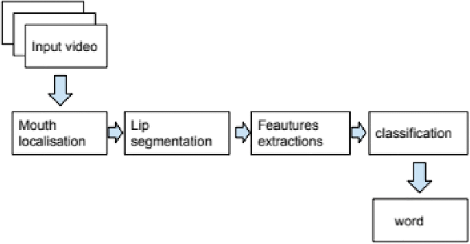
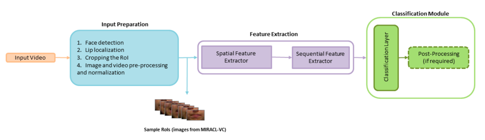

# Abstract

# Acknowledgements

# Introduction

# Background Research

## 1.1 Introduction

Lip-reading which also called Vision Speech Recognition (VSR) is the process of understanding speech by observing a
speaker's lip movements, without hearing the sound. Lip-reading is a challenging task because of the variability in the
lip movements of different speakers and the ambiguity in the lip movements of the same speaker. The variability in the
lip movements of different speakers is due to the differences in the shape and size of the lips, the speed of speech,
and the accent of the speaker. The ambiguity in the lip movements of the same speaker is due to the fact that the same
lip movement can correspond to different sounds, and different lip movements can correspond to the same sound.
Lip-reading is an important task because it can be used to improve the performance of speech recognition systems in
noisy environments, and to enable people with hearing impairments to communicate more effectively.

Due to the development of deep neural networks and the availability of large datasets, lip-reading has evolved
from recognition of single alphabets to recognition of complete words and recently to recognition of complete
sentences,which is significantly improvement in the field of lip-reading.

Lip-reading can be typically followed by this framework:

1. frontend: extract visual features from the input video.
2. backend: classify the visual features into words.

For an automated lip-reading system, the process are illustrated in Figure 1.1.
  
figure 1.1: The process of an automated lip-reading system.

### 1.1.1 Frontend:feature extraction

The frontend of a lip-reading system plays a critical role in accurately interpreting and process visual speech
information.
It consists of two main components: mouth region detection and visual feature extraction,both of which are pivotal for
the successful operation of the system.

#### Mouth Region Detection

The mouth region detection is to locate the mouth region in the input video, and normally it can be achieved by using
face detection algorithms, like OpenCV, Dlib, MTCNN, mediapipe, etc. Once the mouth region is detected, it's cropped,
resized, and normalized to a fixed size, with standardized channel and RGB values. This normalization is crucial for
ensuring consistency in the input data fed into the neural networks for visual feature extraction.

#### Visual Feature Extraction

The visual feature extraction is to extract visual features from the mouth region images. The visual features can be
extracted by using neural networks, like CNN,RNN,LSTM,GRU,Transformer, etc. Most of the recent works use CNN to extract
visual features. Because CNN can capture the spatial information of the input images, However, CNN can not capture the
temporal information of the input images. To capture the temporal information of the input images,
RNN,LSTM,GRU,Transformer can be used to support CNN.

**CNN**

CNN is a feedforward neural network that is designed to capture the spatial information of the input images. CNN is
composed of multiple layers, including convolutional layers, pooling layers, and fully connected layers.
The convolutional layers are used to extract features, the pooling layers are used to reduce the size of the features,
and the fully connected layers are used to classify the features.

figure 1.2: The structure of a convolutional layer.

In the convolutional layer, the input image is convolved with a set of filters to produce a set of feature maps. Each
feature map is produced by convolving the input image with a filter and applying a non-linear activation function to
the result. The feature maps are then passed through a kernel size to reduce the size of the feature maps. With multiple
convolutional layers, the network can learn to extract features at different levels of abstraction.

**RNN**

Recurrent Neural Networks (RNNs) are pivotal in modeling sequence data, and the Long Short-Term Memory (LSTM) and Gated
Recurrent Unit (GRU) architectures are two of the most popular RNN types used to capture temporal information
effectively.
Both are desgined to address the vanishing gradient problem commonly associated wth standard RNNs, thereby enabling the
learning of dependencies at different time scales.

LSTM units are an advanced type of RNN architecture which are designed to remember information for long periods of time.
Each LSTM cell consists of components that work together to regulate the flow of information. These components are:

1. **Input Gate**: Determines how much of the new incoming information to store in the cell state.
2. **Forget Gate**: Decides the information that is no longer required by the model and thus can be thrown away from the
   cell state.
3. **Output Gate**: Controls the amount of information to be outputted from the current cell state to the next layer in
   the network.
4. **Cell State**: The internal memory of the LSTM which carries relevant information throughout the processing of the
   sequence.

GRU simplifies the LSTM architecture and merges the input and forget gates into a single "update gate." It also merges
the cell state and the hidden state,thereby reducing the complexity of the model. The GRU consists of the following
components:

1. **Reset Gate**: Determines how much of the past information needs to be forgotten.
2. **Update Gate**: Decides how much of the new information needs to be stored in the cell state.
3. **Hidden State**: The new state is a blend of the old state and the new candidate state, controlled by the update
   gate.

GRUs provide a more simplified and computationally efficient model compared to LSTMs while achieving similar
performance, which makes them particularly useful when training data is limited or when computational efficiency is
crucial.

**Transformer**
The Transformer model, introduced in the paper "Attention is All You Need" by Vaswani et al.in 2017, represents a
significant breakthrough in deep learning, particularly in the field of natural language processing(NLP). It deviates
from previous sequence-to-sequence models that relied heavily on recurrent neural networks (RNNs) or convolutional(
CNNs) layers, instead employing a novel architecture centered around the mechanism of self-attention.

Transformers provide a robust framework for addressing the complexities of lip-reading by effectively capturing both
spatial and temporal relationships within visual data. Their ability to process sequences in parallel and their
flexibility in focusing on different aspects of the input data make them highly effective for this application.

### 1.1.2 Backend: classification Approaches

In the architecture of a lip-reading system, the backend plays a crucial role akin to that of a decoder in traditional
speech recognition systems. However, unlike typical audio-based systems, the backend of a lip-reading system processes
purely visual data inputs. This section provides an overview of how backend classification and decoding operate within
the context of lip-reading.

**Role of the Backend**

The backend's primary function is to interpret and classify the visual features extracted from the mouth region by the
frontend. These features are then mapped to their corresponding speech outputs, which could be in the form of phonemes,
graphemes, words, or morphemes. The specific processes involved include:

1. **Decoding Process**: This involves the conversion of classified data points into a sequence of speech
   outputs. Decoding in lip-reading utilizes several approaches:
    - **Phoneme-Level**: Breaking down speech into its smallest units of sound, providing a granular level of speech
      recognition.
    - **Grapheme-Level**: Similar to phoneme but focuses on the smallest units of written language that correspond to
      phonemes
    - **Word-Level**: Recognizing complete words, which is a more complex task due to the variability in lip movements
      and the ambiguity in visual speech cues.
    - **Morpheme-Level**: Deals with the smallest meaningful unites of language, which helps in understanding more
      complex linguistic structures.

2. **Classification Process**: This involves the mapping of visual features to their corresponding speech outputs. The
   key challenge here is to accurately identify the speech content based on the visual cues provided by the lip
   movements. Various classification approaches can be employed, including:
    - **Phoneme Classification**: Assigning phonetic labels to the visual features extracted from the mouth region.
    - **Word Classification**: Identifying complete words based on the visual cues provided by the lip movements.
    - **Sentence Classification**: Recognizing entire sentences, which requires a higher level of context and linguistic
      understanding.

#### Classification Models

The classification model is at the heart of the backend, turning complex feature sets into intelligible outputs. Here
are some of the typical approaches used:

**Fully Connected Layers**: After extracting and integrating features via the frontend, these are often passed through
one or more dense layers that help in the classification of features into speech segments.

**Softmax Activation**: A softmax layer is commonly used as the final layer in the classification process. It converts
the output of the neural networks into probability distributions, where each class's probability signifies the
likelihood of that class being the correct classification for the input data.

#### Techniques for Improving Classification

To refine the classification efficacy and adapt the backend for practical applications, several strategies can be
employed:
**Temporal Pooling**:Sometimes, pooling layers are used not just in the frontend for reducing spatial dimensions, but
also in the backend to aggregate temporal data effectively, providing a summarized representation of features over time.
**Sequence Modeling**: Advanced sequence models like LSTMs or Transformers are particularly beneficial when sequences of
visual data (like a sentence's worth of lip movements) need to be classified. They can maintain context over longer
sequences, improving overall accuracy.
**Hybrid Models**: Incorporating both CNNs for spatial processing and RNNs or Transformers for sequence processing in
the backend allows the system to leverage the strengths of both architectural approaches—spatial precision and temporal
context.
**diffusion Models**: merge audio and video inputs to enhance understanding. They employ advanced techniques like
attention mechanisms and neural networks to capture both spatial and temporal cues. By leveraging unlabeled data through
self-supervised learning, these models improve accuracy. In summary, diffusion models offer a comprehensive approach to
lip-reading, promising better performance in speech recognition tasks.

#### Decoding and Mapping

Post-classification, the model outputs need to be decoded into human-readable text. This involves mapping the class
labels (which could be phonemes, words, or other speech units) into actual spoken language:

* CTC Decoding: Connectionist Temporal Classification (CTC) is a popular decoding method that aligns the model's
  predictions with the ground truth labels, allowing for variable-length outputs. It's particularly useful when the
  model needs to predict sequences of varying lengths, such as words or sentences.
* Sequence-to-Sequence Models: These models, often based on the encoder-decoder architecture, are used to map input
  sequences to output sequences. They are effective in lip-reading for translating visual features into spoken language
  outputs.
* Beam Search: A search algorithm that explores multiple possible paths during decoding, allowing for more accurate
  predictions by considering various alternatives.
* Language Models: Incorporating language models can improve the lip-reading system's accuracy by providing additional
  context and linguistic constraints during the decoding process.
* Post-Processing: Techniques like language model rescoring or error correction can be applied after decoding to refine
  the final output and enhance the lip-reading system's performance.

## Dataset

fig 1.3: An overview of Lip Reading Datasets
Based on recording environments/settings, lip reading datasets can be categorized into two types: (1) controlled
settings, and (2) lip-reading in the wild. Controlled settings involve videos recorded in stable environments where the
position of the subjects and the speech content are precisely predefined. On the other hand, 'lip-reading in the wild'
captures datasets from naturally occurring video content, such as lectures and debates, utilizing real-world variability
and complexity. Each approach offers distinct benefits. The remainder of this section reviews major datasets collected
under these settings, primarily in English, which is the predominant language in current collections, though several
well-known datasets in other languages are also introduced (see Figure 2 and Table 1). It's important to note that lip
-reading datasets can also be classified based on the linguistic units they focus on, such as characters, digits, words,
phrases, and sentences, as depicted in Figure 2. Subsequent sections will discuss data-related challenges, potential
solutions, prevalent methods for generating synthetic samples, and the standard criteria for visual speech recognition (
VSR) evaluation.

An straightforward solution is to record videos in a controlled environment, where a human subject is asked to repeat a
set of predefined words or phrases in front of a camera. This method of dataset creation stems from the first
application of automatic lip-reading: to control machines and computers with a specific set of instructions, such as
voice commands. The limited size of vocabulary, clear pronunciations, and controlled recording settings are some
important characteristics of such collections (referred to as controlled datasets). Moreover, due to the limited number
of samples, the annotation process would be less laborious for human editors. In this section, we briefly review
well-known datasets recorded in controlled settings, such as the GRID corpus, TCD-TIMIT, and MIRACL-VC1.

* GRID Corpus: This dataset consists of 34 speakers (18 male and 16 female) each uttering 1000 sentences that cover a
  fixed grammar, which simplifies both the learning task and the annotation process. The consistent and simple structure
  of GRID makes it a standard choice for initial experiments in lip-reading research.
* TCD-TIMIT: Unlike GRID, which uses simple phrases, TCD-TIMIT is derived from the phonetically-rich TIMIT audio corpus.
  It includes videos of 62 speakers reading phonetically balanced sentences, providing both audio and visual data which
  is
  ideal for multimodal learning experiments.
* MIRACL-VC1: This dataset is specifically designed for developing voice control systems and features 15 speakers
  uttering
  a set of isolated words and commands. The controlled nature of MIRACL-VC1, with its clearly articulated phrases and
  limited lexical scope, makes it particularly useful for applications in command-driven computer interfaces.
  While datasets recorded in controlled environments offer distinct advantages for initial modeling and benchmarking,
  they exhibit several limitations that can restrict their application and utility in the field of Visual Speech
  Recognition (VSR). Characteristics such as a limited number of samples per class and a lack of diversity in subject
  demographics mean that while models trained on these datasets may perform well on development and test sets from the
  same collection, they often fail to generalize to videos recorded under real-world conditions. This failure is
  typically due to variations in illumination, speaker pose, and pronunciation distinctiveness that are not represented
  in controlled datasets. Furthermore, it is usually impractical to precisely annotate the boundaries of spoken units in
  videos during test time, which drastically reduces inference accuracy.

Controlled environment videos serve well as benchmarks for evaluating VSR pipelines, to pre-train models, and to
accelerate training convergence. However, the need to develop proper lip-reading datasets from videos recorded in
uncontrolled, or 'in the wild', scenarios remains critical. Therefore, a robust dataset preparation technique must be
designed to automate the annotation process and increase dataset utility.

The automation of video annotation has significantly reduced the workload on human editors and has led to the
development of several datasets that not only improve the accuracy of trained models but also enhance their robustness
and reliability. In what follows, we review some of the well-known English datasets in the wild:

* **LRW (Lip Reading in the Wild)**: This dataset features clips from a variety of BBC programs, capturing over 500,000
  instances of 1,000 words spoken under naturalistic settings. It challenges models with a range of accents, lighting
  conditions, and non-frontal speaker orientations.
* **LRS2 and LRS3-TED**: Extended from LRW, these datasets include longer phrases and full sentences from BBC shows and
  TED Talks, respectively. They provide models exposure to more complex linguistic structures and diverse speaking
  styles, making them highly suitable for advanced lip-reading tasks.
* **AVSpeech**: Comprising millions of aligned audio-visual segments from YouTube, this dataset is particularly valuable
  for training models to perform in highly varied acoustic and visual environments.

## Related Work

Assael et al. introduce "LipNet," an innovative deep learning model for sentence-level lipreading that maps video frames
of a speaker’s mouth directly to text without needing manual alignment or segmentation. Utilizing spatiotemporal
convolutions, recurrent neural networks, and connectionist temporal classification (CTC) loss in an end-to-end training
approach, LipNet is evaluated using the GRID corpus,a dataset with simple grammar and limited vocabulary, enhanced with
data augmentation techniques like mirroring and frame manipulation. Achieving a remarkable 95.2% accuracy in
sentence-level word prediction, LipNet significantly outperforms experienced human lipreaders and prior models,
demonstrating effective generalization across unseen speakers and sensitivity to key phonological features. This
breakthrough suggests that with more extensive datasets, the model could be further improved and potentially applied to
more complex audio-visual speech recognition tasks, representing a substantial advancement in assistive technologies for
the hearing impaired and robust speech recognition systems in noisy environments  
Ma et al. explore the augmentation of training datasets for Audio-Visual Speech Recognition (AVSR) through the use of
automatically-generated transcripts of unlabeled datasets. This innovative approach leverages the capabilities of
existing pre-trained Automatic Speech Recognition (ASR) models to transcribe large-scale datasets like AVSpeech and
VoxCeleb2, addressing the challenge of expensive and time-consuming manual labeling. The authors demonstrate that
incorporating these automatically transcribed datasets into the training process, alongside traditional datasets such as
LRS2 and LRS3, significantly enhances model performance, achieving state-of-the-art results on LRS2 and LRS3 with a
notable Word Error Rate (WER) reduction. This study not only sets new benchmarks in AVSR performance but also
illustrates the potential of utilizing automatically generated labels to expand training datasets, thus paving the way
for more robust and accurate AVSR systems capable of functioning effectively in real-world noise conditions.  
In "Deep Audio-Visual Speech Recognition," Afouras et al. explore the enhancement of speech recognition through the
integration of audio and visual data using transformer-based models, tested on the LRS2-BBC dataset. The study
demonstrates how visual information can significantly improve recognition accuracy in noisy environments by employing
models with dual attention mechanisms that process both modalities. Particularly, the seq2seq model excels in
environments with clean audio, while combined with the CTC model, it adeptly handles asynchronous data scenarios. This
research advances audio-visual speech recognition, offering robust solutions for real-world applications, such as
interactive systems and aids for the hearing impaired, underscoring the potential of multimodal approaches in overcoming
environmental noise challenges.  
Ma, Petridis, and Pantic present a pioneering study that integrates a hybrid CTC/Attention model using ResNet-18 and
Conformer architectures for audio-visual speech recognition (AVSR). This model uniquely processes raw pixels and audio
waveforms directly, eschewing pre-computed features common in earlier models. Evaluated on the largest publicly
available sentence-level speech datasets, LRS2 and LRS3, the approach significantly outperforms previous models in
audio-only, visual-only, and audio-visual configurations, demonstrating robustness across diverse noise conditions. By
replacing recurrent networks with Conformers and employing a transformer-based language model, the study not only
enhances performance but also sets new benchmarks in the field, showcasing the effectiveness of end-to-end training in
AVSR.  
Battenberg et al. perform a comprehensive empirical comparison among three prominent speech recognition models: CTC,
RNN-Transducer, and attention-based Seq2Seq. These models are evaluated for their ability to handle end-to-end learning
without reliance on language models, demonstrating that Seq2Seq and RNN-Transducer models significantly outperform
traditional CTC approaches on the Hub5’00 benchmark. The study finds that the RNN-Transducer not only simplifies the
decoding process but also enhances model performance through its unique handling of alignment and output dependencies,
without the conditional independence limitations seen in CTC. This work highlights the efficacy of RNN-Transducers in
reducing the complexity of speech recognition systems while maintaining high accuracy, thereby setting the stage for
future innovations in speech processing technologies.  
Shillingford et al. from DeepMind and Google tackle the challenge of open-vocabulary visual speech recognition by
creating the largest dataset of its kind, featuring 3,886 hours of video which maps video clips of faces to sequences of
phonemes and words. Their system, which includes a novel lip-reading model called Vision to Phoneme (V2P), leverages
spatiotemporal convolutions and a deep neural network to reduce the word error rate (WER) to 40.9%, a significant
improvement over professional lipreaders and previous methods such as LipNet and Watch, Attend, and Spell (WAS), which
achieve WERs of 89.8% and 76.8%, respectively. This work not only advances the state-of-the-art in visual speech
recognition but also demonstrates the potential of using such technologies to aid individuals with speech impairments,
contributing a substantial dataset and a scalable model framework for future research.  
Feng et al. present a comprehensive analysis of various training strategies to optimize lip reading models without
overhauling the underlying architecture. Utilizing the LRW and LRW-1000 datasets, they enhance a baseline lip reading
model through incremental refinements in data processing, training protocols, and module choices, improving performance
dramatically—from 83.7% to 88.4% and from 38.2% to 55.7% accuracy on these datasets, respectively. Key innovations
include the integration of easy-to-implement enhancements such as MixUp augmentation, label smoothing, and learning rate
scheduling adjustments. Their results not only surpass current state-of-the-art outcomes but also demonstrate the
substantial impact of refined training techniques on the efficacy of deep learning models in visual speech recognition.
This study underscores the potential of 'low-cost' optimizations to significantly advance model performance, offering a
pragmatic roadmap for future research in lip reading and related fields.  
Kim, Hong, and Ro from KAIST propose an innovative multi-task learning framework that enhances lip-to-speech synthesis
by incorporating both feature-level and output-level content supervision. This methodology addresses the challenge of
synthesizing intelligible speech in uncontrolled environments by leveraging multimodal supervision, which combines
textual and acoustic cues. By integrating Connectionist Temporal Classification (CTC) for text prediction and a novel
acoustic feature reconstruction strategy, their model achieves high-quality speech synthesis across diverse conditions
found in the LRS2, LRS3, and LRW datasets. The results show significant improvements in Word Error Rates (WERs),
outperforming previous state-of-the-art methods and demonstrating the model's ability to handle sentence complexity and
speaker variability effectively. This approach not only advances the capabilities of lip-to-speech systems but also
suggests a scalable framework for developing more robust speech technologies in noisy and dynamic settings.  
Chung, Senior, Vinyals, and Zisserman introduce the Watch, Listen, Attend and Spell (WLAS) network, a pioneering
approach to unconstrained lip reading in natural language sentences, using a novel dual attention mechanism that decodes
visual information from video input into character-level transcriptions. Leveraging the newly developed large-scale Lip
Reading Sentences (LRS) dataset, composed of over 100,000 sentences from diverse BBC television broadcasts, their model
significantly surpasses the performance of all previous works on standard lip reading benchmarks. This study not only
demonstrates the capability of WLAS to outperform professional human lip readers in transcribing spoken content from
video but also highlights the utility of integrating audio-visual data to improve speech recognition systems,
particularly in noisy environments. The results advocate for the expansion of visual speech recognition technologies,
potentially benefiting silent film analysis, multi-speaker communication, and general speech recognition enhancements.  
Hong et al. address the challenge of simultaneous audio and visual input corruption in Audio-Visual Speech Recognition (
AVSR). The paper introduces a novel framework, the Audio-Visual Reliability Scoring module (AV-RelScore), which
dynamically assesses the reliability of each modality to optimize speech recognition accuracy under multimodal
corruption. This method is particularly effective in environments where both audio and visual signals may be degraded,
such as noisy or visually obstructed settings encountered in real-world applications. Extensive experiments on the LRS2
and LRS3 datasets demonstrate that the AV-RelScore framework not only outperforms traditional unimodal and multimodal
approaches in terms of robustness but also provides a significant reduction in word error rate (WER), thereby advancing
the state-of-the-art in robust AVSR technologies.  
The ensemble of reviewed studies underscores substantial advancements in audio-visual speech recognition (AVSR) and
lip-reading through the integration of deep learning technologies. Key insights include the efficacy of end-to-end
models like LipNet, which bypass manual segmentation to notably exceed traditional accuracy benchmarks. Utilizing
automatically generated transcripts to train on large-scale, unlabeled datasets has been shown to enhance model
performance significantly. Innovations such as Conformers and transformer-based models that process raw inputs directly
have set new performance standards, especially in noisy environments. These studies affirm the crucial role of
multimodal data integration for maintaining accuracy amidst poor audio quality and highlight methods that dynamically
assess the reliability of multimodal inputs, bolstering robustness in varied real-world conditions. Moreover, strategic
training optimizations and data augmentation methods are instrumental in advancing lip-reading model capabilities.
Collectively, these technological strides are paving the way for more inclusive and effective communication systems,
tailored to real-world applications.

# System Design

## Introduction

In this paper, we investigate the influence of input resolution on the performance of a lip-reading model that
integrates three-dimensional convolutional neural networks (Conv3D), Long Short-Term Memory networks (LSTM), and
Connectionist Temporal Classification (CTC) for training. This combination leverages spatial feature extraction through
Conv3D, temporal dynamics captured by LSTM, and an end-to-end training approach offered by CTC, which is well-suited for
sequence prediction problems such as lip-reading.
Our study compares the character error rate (CER) and word error rate (WER) of two models: one trained on
low-resolution (35x70 pixels) and the other on high-resolution (70x140 pixels) datasets. These metrics gauge the models'
abilities to accurately recognize and reproduce characters and words from visual information alone. By presenting a
side-by-side analysis of models trained with varying input resolutions, we aim to illuminate the trade-offs between
computational efficiency and the precision of lip-reading models. Furthermore, the paper discusses the implementation of
an online platform to assess the practical capabilities of the trained models in real-world scenarios.

fig 2.1: The architecture of the proposed lip-reading system.

The system starts by processing 75 frames of video data, where each frame is processed to detect the speaker's face
using OpenCV's face detection capabilities. Once the region of interest is isolated, it undergoes a normalization
process to standardize the input for consistent model training.

At the core of the model are three layers of 3D convolutions (Conv3D), each followed by a Rectified Linear Unit (ReLU)
activation and 3D max pooling. These layers are designed to capture the spatial and temporal patterns of mouth movements
across the video sequence.

Following the convolutional base, the output is then flattened and distributed over time to transform the data into a
format suitable for sequential processing. This is crucial for preparing the high-dimensional convolutional output for
the recurrent layers that follow.

The temporal dynamics of speech are modeled using a stack of two bidirectional Long Short-Term Memory (LSTM) layers,
with dropout layers interspersed to prevent overfitting. This bidirectional approach captures dependencies in both
directions of the temporal sequence, which is essential for understanding the context of visual speech.

Finally, a Connectionist Temporal Classification (CTC) layer aligns the input sequences with their corresponding
transcriptions without requiring pre-segmentation through character-level predictions. a method particularly well-suited
for tasks with variable-length inputs and outputs. The output of the CTC layer is then passed through a softmax
activation function to generate a probability distribution over the possible transcriptions for each sequence.

This system design, which integrates face detection, convolutional neural networks, LSTM layers, and CTC within an
end-to-end trainable model, is tailored to maximize performance for sentence-level lip-reading tasks. By utilizing the
GRID dataset, known for its clear structure and limited vocabulary, the model is expected to deliver high-accuracy
transcriptions even on systems without specialized hardware, making it a versatile solution for real-world speech
recognition challenges.

## Requirements

Our lip-reading system is developed in Python and utilizes TensorFlow and PyTorch frameworks for deep learning tasks.
Additionally, we employ OpenCV and MediaPipe for video processing and facial feature extraction. The system is designed
to be flexible,accommodating both TensorFlow and PyTorch implementations to cater to different user preferences and
requirements.

### TensorFlow Implementation

For the TensorFlow implementation, we recommend the jupyter notebook environment for interactive development and testing
of the lip-reading model. Because in jupyter notebook, you can easily visualize the intermediate outputs and debug the
code. The following libraries are required for the TensorFlow implementation:

Jupyter notebook: An interactive development environment for running Python code in a notebook format.
TensorFlow: An open-source deep learning framework developed by Google for building and training neural networks.
OpenCV: A computer vision library that provides tools for image and video processing.

### PyTorch Implementation

For the PyTorch implementation, we recommend using the PyCharm IDE for a more structured development environment. In
PyTorch, you can easily look at the whole codebase and navigate through the codebase,which is beneficial for large
projects, and it provides a more comprehensive debugging experience. The following libraries are required for the
PyTorch implementation:

PyCharm: An integrated development environment for Python that provides code navigation, debugging, and code completion
features.
PyTorch: An open-source deep learning framework developed by Facebook for building and training neural networks.
MediaPipe: A library that provides tools for face detection, facial landmark detection, and pose estimation.
ctcdecode: A library that provides connectionist temporal classification (CTC) decoding for PyTorch models.

### Hardware Requirements

We recommend using a machine with a GPU memory of at least 8GB for training the lip-reading model. The GPU should be
capable of running deep learning tasks efficiently, and we recommend using NVIDIA GPUs for optimal performance. For
inference tasks, a CPU with at least 16GB of RAM is sufficient to run the lip-reading model.We also recommend using
ubuntu 20.04 LTS as the operating system for the development of the lip-reading system.

## Architecture

In our study, we adopted a Conv3D-LSTM-CTC architecture for our lip-reading system. The models were evaluated at two
different resolutions: the baseline model at 70x140 pixels and a reduced resolution model at 35x70 pixels. The system
processes a sequence of 75 video frames, each transformed to a dimensionality of T x H x W x C, where T represents the
number of frames, H is the frame height, W is the frame width, and C denotes the number of channels. Specifically, the
dimensions are (75, 70, 140, 1) for the baseline model and (75, 35, 70, 1) for the low-resolution model. The batch size
is omitted for clarity in the information flow as described. Moreover, The total parameters of the model are

Once the video data enters the system, it encounters a succession of 3D convolutional layers designed to extract
comprehensive spatial and temporal features from the imagery of the mouth region. Following this feature extraction, the
data is flattened and then reshaped, a necessary preprocessing step for the LSTM layers. These LSTM layers are
configured to be bidirectional, thereby capturing the nuanced temporal dependencies present in both forward and reverse
directions of the speech sequence.

The penultimate stage of the process involves the output from the LSTM layers being channeled into a Connectionist
Temporal Classification (CTC) layer. This CTC layer plays a pivotal role in aligning the variably timed input sequences
with the corresponding textual labels, thereby enabling the model to generate accurate transcriptions of the spoken
words captured in the video frames.

## Training

The lip-reading model is trained using the GRID dataset, which consists of 34 speakers each uttering 1000 sentences.
The dataset is split into training, validation, and test sets, with 80% of the data used for training, 20% for
validation, The model is trained using the Adam Optimizer with a initial learning rate of 0.0001 and a batch size of 4,
We write a function to dynamically adjust the learning rate during training to ensure optimal convergence. every 10
epochs the learning rate is reduced by a factor of 0.1 to prevent overshooting and improve model performance.
training process involves minimizing the CTC loss function, which aligns the predicted sequences with the ground truth
transcriptions. The model is trained for 100 epochs to ensure convergence and optimal performance.

The training process involves the following steps:

1. Data Preprocessing: The input videos are preprocessed to extract the mouth region, normalize the images, and resize
   them to the desired resolution.
2. Feature saving: The visual features extracted from the mouth region images are saved to disk for faster training.
3. Model Initialization: The Conv3D-LSTM-CTC model is initialized with random weights and biases.
4. Training Loop: The model is trained on the training set using the Adam optimizer and CTC loss function.
5. Validation: The model's performance is evaluated on the validation set to monitor training progress and prevent
   overfitting.
6. Model Saving: The trained model is saved to disk for future use and evaluation.

The Data Preprocessing process is repeated for both the baseline model (70x140 resolution) and the low-resolution
model (35x70
resolution) to compare their performance on the test set.

## Evaluation

The performance of the lip-reading model is evaluated using character error rate (CER) and word error rate (WER)
metrics. CER measures the accuracy of character-level predictions, while WER assesses the accuracy of word-level
predictions. The model is evaluated on the test set of the GRID dataset to determine its effectiveness in recognizing
spoken words from visual information alone. The results are compared between the baseline model trained on
high-resolution data and the low-resolution model to analyze the impact of input resolution on lip-reading performance.

### CER Calculation

Character Error Rate (CER) is a common metric used to evaluate the performance of optical character recognition (OCR),
handwriting recognition, and speech recognition systems. It is a measure of the number of character-level errors in a
transcript compared to the length of the correct transcript. Essentially, CER provides a way to quantify the accuracy of
a model in terms of how many individual character mistakes were made.

To calculate CER, you compare the system output (the "hypothesis") to the correct or reference text. The comparison is
done using the edit distance algorithm, also known as the Levenshtein

The formula to calculate CER is:

    Where:
    - S is the total number of substitutions (incorrect characters) 
    - D is the total number of deletions (missing characters)
    - I is the total number of insertions (extra characters)
    - N is the total number of characters in the reference text

CER is typically expressed as a percentage, with lower values indicating better performance. For example, a CER of 5%
means that 5% of the characters in the system output are incorrect compared to the reference text.

### WER Calculation

Word Error Rate (WER) is another standard metric used to evaluate the performance of speech recognition systems, as well
as in other domains like natural language processing where the correct transcription of words is crucial. Similar to
CER, WER is based on edit distance, but operates at the word level rather than the character level.

WER is calculated as the sum of substitutions (S), insertions (I), and deletions (D) required to change the hypothesis (
the recognized word sequence) into the reference (the correct word sequence), divided by the number of words in the
reference:

    Where:
    - S is the total number of substitutions (incorrect words)
    - D is the total number of deletions (missing words)
    - I is the total number of insertions (extra words)
    - N is the total number of words in the reference text

WER is also expressed as a percentage, with lower values indicating better performance.

### CTCLoss Calculation

Connectionist Temporal Classification (CTC) Loss is a loss function used primarily for sequence prediction tasks without
a pre-defined alignment between the input and the output. This is especially useful in tasks like speech recognition,
where the length of the speech input does not directly correspond to the length of the transcribed text output.

CTC is designed to align sequences of predictions to the target text by introducing a special 'blank' symbol that the
algorithm can use to output when there is no confident prediction for a character at a given time step. This allows the
algorithm to map sequences of varying lengths to each other.

The CTC loss function computes the probability of the target sequence given the input sequence and then takes the
negative log of this probability as the loss value. It sums over all possible alignments of the input to the target,
considering the insertions of blanks and the possibility of collapsing repeated characters in the target.

The calculation of CTC loss involves dynamic programming and can be quite complex to explain in detail here, but a
simplified explanation is as follows:

Compute the probabilities of each character at each time step in the input sequence (including the 'blank').
Sum the probabilities of all valid paths through the time steps that correspond to the correct labeling (taking into
account the collapsing of repeated characters and the placement of blanks).
The loss is then the negative log probability of the correct sequence, which can be computed efficiently using the
forward-backward algorithm.
Mathematically, for a single instance, CTC loss can be described as:
  
Where P(target∣input) is the probability of the target sequence given the input sequence. This is the sum of the
probabilities of all possible paths that correctly map the inputs to the target sequence.

CTC is used in training time to provide a differentiable loss value that the optimizer can minimize, and during
inference, it is used with a decoding step (such as greedy decoding or beam search) to output the final predicted
sequence.

#### CTC Alignment

Connectionist Temporal Classification (CTC) is an algorithm used to train deep learning models, particularly Recurrent
Neural Networks (RNNs), for sequence prediction problems where the alignment between the inputs and the target outputs
is not known beforehand. It is extensively used in tasks like speech and handwriting recognition, where the length of
the audio or written input does not directly correspond to the length of the output text.

The CTC algorithm works through the following process:

1. Input Processing: An RNN processes the input sequence (e.g., audio frames or video frames) and outputs a sequence of
   probability distributions over the possible output tokens, which include a special 'blank' token.
2. Alignment and Probability Distribution: The output sequence from the RNN consists of a probability distribution for
   each
   time step, providing probabilities for all possible output tokens, including the blank token.
3. Possible Alignments Generation: CTC generates all possible alignments of the output tokens that can be mapped to the
   target sequence, including the use of the blank token. This accounts for situations where certain input features may
   not
   clearly correspond to any output token or may correspond to the same token repeatedly.
4. Merge Repeated Tokens and Remove Blank Tokens: CTC merges consecutive repeated tokens and removes the blank tokens
   from
   the alignment to produce the final output sequence. For example, the sequence "a--aa-abb" would collapse to "aab".
   Loss Computation: The CTC loss function calculates the total probability of the correct target sequence by summing
   the
   probabilities of all possible valid alignments that map to the target sequence. The loss is then defined as the
   negative
   log-likelihood of these probabilities.
5. Optimization: During training, the network's parameters are optimized to minimize the CTC loss. This encourages the
   network to learn alignments that maximize the probability of the correct target sequence.
6. Decoding: During inference, a decoding step is used to convert the output probability distributions into a final
   sequence. The most common decoding strategies are greedy decoding, which selects the most likely token at each time
   step, and beam search decoding, which keeps track of multiple possible sequences to find a better approximation of
   the most likely output sequence.

CTC is particularly powerful because it enables the model to be trained end-to-end without any pre-segmented training
data, and it allows for variable-length input sequences to be mapped to variable-length output sequences. This is
achieved without any explicit alignment between the input and output sequences, which makes CTC applicable to a wide
range of sequence prediction tasks.

fig 2.2: CTC example for Alignment

### Beam Search and Greedy Search

Beam search is a heuristic search algorithm that explores a graph by expanding the most promising node in a limited set.
It's commonly used in sequence prediction problems, especially where the space of possible sequences is very large, like
machine translation, speech recognition, and text summarization.
Greedy search, on the other hand, is a simple search algorithm that makes the best choice at each step with the hope of
finding the optimal solution. It's computationally efficient but may not always lead to the best overall solution.

Beam search is a balance between the greedy search, which always selects the single best node at each step, and
breadth-first search, which considers all possible nodes. It is a useful algorithm when the goal is to find a reasonably
good solution in a large or infinite search space where exhaustive search is not feasible.

In the context of lip-reading, beam search can be used to decode the output of the lip-reading model, which generates a
sequence of characters or words. By exploring multiple possible paths through the sequence, beam search can find the
most likely transcription of the input video data. This is particularly useful when the lip-reading model outputs
probabilities for each character or word, and the final transcription needs to be determined based on these
probabilities.

## Results

The table below encapsulates the comparative analysis of two models trained on the Grid Corpus dataset, differentiated
by input resolution. The first model processed inputs at a low resolution of 35x70 pixels, while the second model
operated at a high-resolution setting of 70x140 pixels. Both models underwent training for 100 epochs, sharing a
consistent batch size of 4 and a learning rate set to 0.0001.

The results highlight a stark contrast in performance, with the high-resolution model exhibiting a Character Error
Rate (CER) of 0.0008 and a Word Error Rate (WER) of 0.0033. These figures significantly outperform the low-resolution
counterpart, which registered a CER of 0.3034 and a WER of 0.3015. The comparative metrics unequivocally demonstrate the
superiority of the high-resolution model, underscoring the critical role of input resolution in the effectiveness of
lip-reading models. The high-resolution model's performance emphasizes its enhanced capacity to accurately interpret and
predict based on the dataset, leading to substantial improvements in both CER and WER.

table 2.1: Comparative Analysis of Lip-Reading Models

fig 2.3: CER for different models

fig 2.4: WER for different models

fig 2.5: CTC Loss for different models

The graphical representations underscore the comparative analysis of two distinct resolution models trained on the same
dataset, spotlighting a conspicuous divergence in performance. The graphs for both Character Error Rate (CER) and Word
Error Rate (WER) conspicuously delineate the substantial discrepancy in proficiency, with the high-resolution model
attaining an accuracy that verges on perfection, a stark contrast to its low-resolution counterpart.

The CTC loss graph serves as a further testament to the dominance of the high-resolution model, illustrating its
adeptness at mitigating loss and honing training efficacy. Despite these advantages, the high-resolution model demands
greater computational expenditure and memory usage, which could pose constraints on its scalability and practical
application within real-world settings.

Conversely, the low-resolution model, despite trailing in accuracy, presents a more computationally frugal option,
potentially aligning better with the confines of resource-restricted environments. The trade-off between precision and
computational demand is encapsulated by the differential in training duration—4.319 hours for the higher resolution,
against a substantially shorter span of 1.212 hours for the lower resolution. This dichotomy is crucial when considering
the deployment context, be it for on-device applications where efficiency is paramount, or cloud-based solutions where
resource availability may be less of a concern.

## Online Platform

In an effort to assess the real-world efficacy of the developed lip-reading models, an innovative online platform has
been crafted. This platform revolutionizes the process of predictive analysis by offering an interactive and
user-centric interface. Users are invited to upload a video file, from which spoken content is extracted. Utilizing
OpenCV, a prominent open-source computer vision library, the platform meticulously isolates the mouth region within the
video frames and standardizes the image dimensions to match the model's requirements.

Upon processing the visual data, the refined mouth region images are subsequently input into the pre-trained lip-reading
model. This integration is adeptly accomplished using the powerful deep learning frameworks TensorFlow and PyTorch. The
model then diligently interprets the lip movements and renders a written transcript of the articulated words. In
addition to the transcription, the platform furnishes users with quantifiable insights into the accuracy of the
predictions by displaying the Word Error Rate (WER) and Character Error Rate (CER) metrics.

The underlying architecture of this platform is powered by Streamlit, an exceedingly efficient Python library that
specializes in constructing interactive web applications rapidly and with a lean codebase. Through this platform, users
are endowed with the flexibility to select between different models, essentially tailoring the transcription process to
their specific needs and preferences. This feature underscores the platform's commitment to versatility and
customization, making it an exemplary tool for a myriad of applications, from aiding communication for the hearing
impaired to enhancing language learning methodologies.

fig 2.6: Online Platform for Lip-Reading

# Conclusion

## Introduction

This chapter draws together the key findings from the research, providing a conclusive insight into the comparative
analysis of low-resolution and high-resolution lip-reading models trained on the Grid Corpus dataset. The chapter will
distill the essence of the data, reflect on the implications of the results, and propose recommendations for future work
in the domain.

## Reflection

The study's core revelations are quite profound. The high-resolution model demonstrated superior accuracy, with lower
Character Error Rate (CER) and Word Error Rate (WER), substantiating the hypothesis that higher input resolutions
significantly enhance model performance in lip-reading tasks. This performance leap is attributed to the model's ability
to capture finer details and nuances in lip movement, which are pivotal for accurate lip-reading.

However, the results also brought to light the trade-offs between accuracy and computational efficiency. While the
high-resolution model excelled in precision, it also required more than thrice the computational time compared to the
low-resolution model. This finding is particularly relevant in the context of real-world applications where resources
and processing time are often limited.

## Recommendations

Based on the insights gleaned from this research, the following recommendations are proposed:

Model Optimization: For environments where computational resources are constrained, it is recommended to focus on
optimizing high-resolution models to reduce complexity without a significant compromise on accuracy.
Hybrid Approaches: Investigate hybrid models that can dynamically adjust resolution based on the complexity of the input
data and available computational resources, potentially combining the strengths of both resolution models.
Hardware Considerations: Develop specialized hardware accelerators that can more efficiently handle high-resolution
data, reducing the computational load on general-purpose processors.
Extended Datasets: To generalize the findings, replicate the study across a wider range of datasets and in more diverse
conditions to validate the model's robustness and performance consistency.
Real-World Testing: Pilot the high-resolution model in real-world scenarios to evaluate its performance in practical
settings, gather user feedback, and refine the model accordingly.
Accessibility: Consider the implications of these findings for assistive technologies, and how such lip-reading models
can be developed to better serve individuals with hearing impairments.
In conclusion, while the findings favor the high-resolution model for its accuracy, the considerations around deployment
and resource management are non-trivial. As the field of lip-reading technology advances, it is imperative to balance
computational demands with the quest for precision, ensuring that these innovations are both effective and accessible
for all intended applications.

## Concerns

Despite the remarkable accuracy observed in the Word Error Rate (WER) and Character Error Rate (CER) metrics, there are
pertinent concerns that must be addressed. A paramount concern is the potential for overfitting. Given the high
performance on the Grid Corpus dataset, one must critically assess whether the model has simply memorized the dataset
patterns rather than learned to generalize from them. This is a significant risk, especially considering the constrained
vocabulary of the dataset, which may not reflect the complex and variable nature of real-world scenarios.

Furthermore, the current methodology employs a character-spelling approach to prediction. While technically effective,
this method diverges from natural human linguistic processes, which lean more heavily on phonemes—the distinct units of
sound that distinguish one word from another in language—for word construction and pronunciation. This deviation
suggests a gap between the model’s operational logic and human speech patterns, which could impede the model's
applicability in more naturalistic settings.

Lastly, the integration of a language model stands out as a vital component for future enhancement. Such a model would
contextualize the predictions, refining accuracy by incorporating syntactic and semantic understandings of language.
This addition could vastly improve the model's ability to predict sequences that are not just phonetically accurate but
also linguistically coherent, thereby moving towards a more human-like performance in lip-reading tasks. Addressing
these concerns is essential for advancing the model beyond controlled conditions and into the multifaceted realm of
everyday communication.

## Glossary

Activation Function: A function in a neural network that introduces non-linearity, allowing the network to learn complex
patterns.

Backpropagation: An algorithm used in training neural networks, where the error is propagated back through the network
to update the weights.

Batch Size: The number of training samples used in one iteration of model training.

Beam Search: A search algorithm that expands the most promising nodes in a limited set and is often used in sequence
prediction tasks.

Character Error Rate (CER): A performance metric in lip-reading that measures the character-level discrepancies between
the predicted and actual text.

Convolutional Neural Network (CNN): A type of neural network that uses convolution operations to process data in a
grid-like topology, such as images.

Conv3D: A type of convolutional neural network that operates on 3D data, such as video sequences.
CTC Loss (Connectionist Temporal Classification Loss): A type of loss function used for training sequence prediction
models without a pre-defined alignment between inputs and outputs.

Dataset: A collection of data used for training or evaluating a neural network.

Dense Layer: A fully connected neural network layer where each input node is connected to each output node.

Epoch: One complete pass of the training dataset through the neural network.

Feature Extraction: The process of transforming raw data into a set of features that can be used for training a model.

Grid Corpus Dataset: A standard dataset used in visual speech recognition, consisting of controlled, head-and-shoulders
video recordings of subjects speaking.

Learning Rate: A hyperparameter that controls the amount by which the weights of the neural network are updated during
training.

LSTM (Long Short-Term Memory): A type of recurrent neural network (RNN) architecture used to learn dependencies in
sequence prediction problems.

Normalization: The process of adjusting and scaling data to a standard range.

Optical Character Recognition (OCR): The conversion of different types of documents, such as scanned paper documents,
PDFs, or images captured by a digital camera, into editable and searchable data.

Overfitting: A modeling error in neural networks where the model learns the detail and noise in the training data to the
extent that it negatively impacts the performance on new data.

Phoneme: The smallest unit of sound in a language that can distinguish one word from another.

Recurrent Neural Network (RNN): A type of neural network where connections between nodes form a directed graph along a
temporal sequence, allowing it to exhibit temporal dynamic behavior.

TensorFlow: An open-source software library for dataflow and differentiable programming across a range of tasks,
primarily used for training and inference of deep neural networks.

Transfer Learning: A machine learning method where a model developed for a task is reused as the starting point for a
model on a second task.

WER (Word Error Rate): A common metric for measuring the performance of an automatic speech recognition system,
indicating the percentage of words incorrectly predicted.

Streamlit: A Python library that enables the creation of web apps for machine learning and data science with minimal
coding effort.

Softmax Activation Function: A function that converts the output of a neural network into a probability distribution
over multiple classes.

Sequence2Sequence (Seq2Seq): A neural network architecture used for sequence prediction tasks, such as machine
translation or speech recognition.

## Abbreviations

# References

# Glossary

# List of Abbreviations

# Appendices