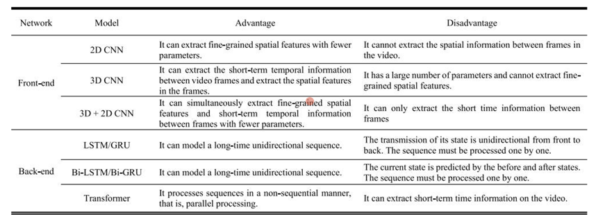
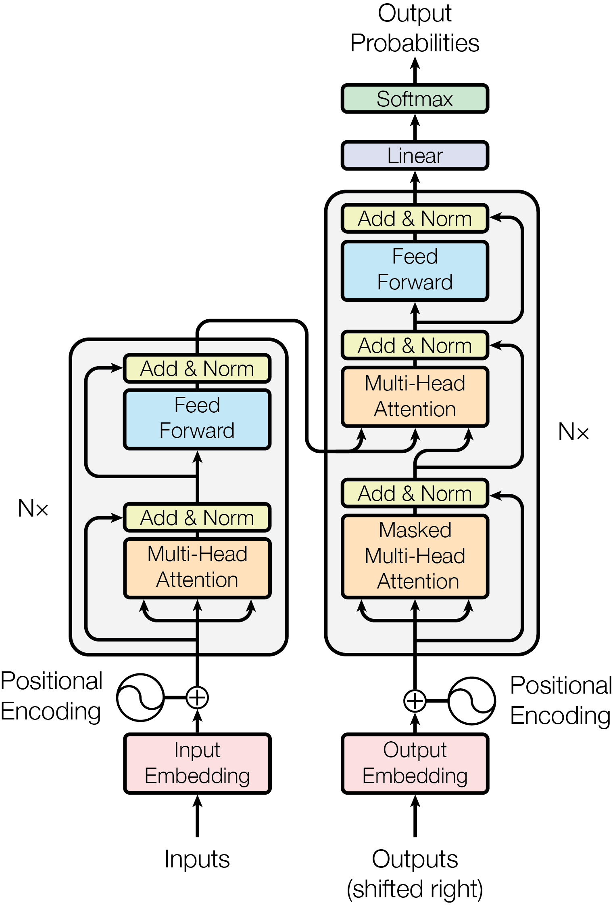
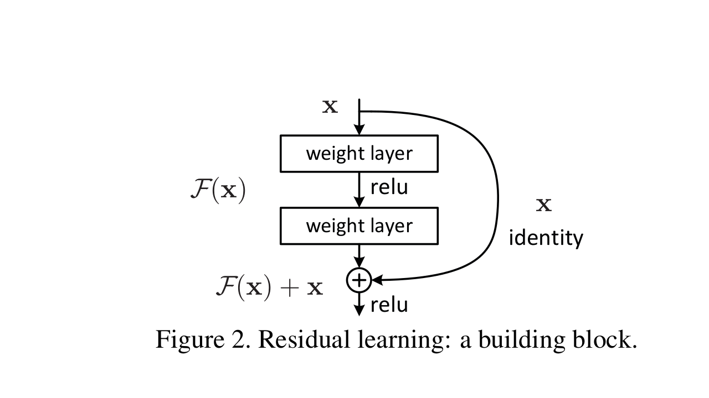

# Summary of reference

## 1. (S. Fenghour, D. Chen, K. Guo, B. Li and P. Xiao, 2021, "Deep Learning-Based Automated Lip-Reading: A Survey,")

**a servey for lip reading
** [Deep_Learning-Based_Automated_Lip-Reading_A_Survey.pdf](..%2Frefference%2FDeep_Learning-Based_Automated_Lip-Reading_A_Survey.pdf)

### The survey topic:

The paper is a survey on automated lip-reading approaches that use deep learning methods for feature extraction and
classification. It also provides comparisons of different components and challenges of lip-reading systems.

### The survey contributions:

The paper claims to have some unique insights, such as comparing different neural network architectures, reviewing the
advantages of attention-transformers and temporal convolutional networks, and covering the most up-to-date lip-reading
systems until early 2021.

### The survey motivation:

The paper states that lip-reading is a multifaceted discipline that has evolved from recognizing isolated speech units
to decoding natural spoken language1. It also states that lip-reading has potential applications in various domains such
as security, entertainment, and education.

### Different types of CNNs for feature extraction:

The article compares the advantages and disadvantages of using 2D, 3D, or 2D+3D convolutional neural networks (CNNs) for
extracting spatial and temporal features from lip images. It also reviews some of the existing architectures that use
CNNs for the frontend of lip-reading systems.

### RNNs, Attention, CTCs, and Transformers for classification:

The article discusses the use of recurrent neural networks (RNNs), attention mechanisms, connectionist temporal
classification (CTC), and transformers for the backend of lip-reading systems. It explains how these methods can handle
sequence prediction, temporal alignment, and long-term dependencies. It also mentions some of the recent works that use
these methods for lip-reading sentences.

### TCNs as an alternative to RNNs:

The article introduces temporal convolutional networks (TCNs) as another option for sequence classification. It
highlights the benefits of TCNs over RNNs, such as parallel computation, flexible receptive field size, and lower memory
requirement. It also cites some of the works that use TCNs for lip-reading words.

### Classification schema for lip-reading:

The article explores the different ways of encoding speech units for lip-reading, such as words, ASCII characters,
visemes, and phonemes. It analyzes the pros and cons of each schema, and how they affect the performance and
generalization of lip-reading systems.

### Audio-visual speech recognition (AVSR) datasets:

* AVLetters, AVICAR, Tulips, M2VTS, and AVDigits for letter and digit recognition.
* MIRACL-VC1, LRW, LRW-1000, IBMViaVoice, OuluVS1, OuluVS2, GRID, LRS2, MV-LRS, LRS3-TED, and LSVSR for word and
  sentence recognition.
* CUAVE, MIRACL-VC1, OuluVS2, MV-LRS, and HIT-AVDB-II for multiview recognition.

The paper also provides a brief description of each dataset, such as the number of speakers, words, sentences, views,
languages, and resolutions. The paper also compares the datasets in terms of their challenges and applications.

### Deep learning methods for lip reading:

A review of recent advances in applying deep neural networks, such as convolutional neural networks (CNNs), recurrent
neural networks (RNNs), long short-term memory (LSTM) networks, and attention mechanisms, to lip reading tasks, such as
word or sentence recognition .

### Challenges and future directions for lip reading:

the challenges and potential advancements in automated lip-reading systems. It mentions the possibility of creating
lexicon-free systems that could predict words not present in the training phase by using phonemes and visemes. However,
several challenges remain, such as predicting unseen words, handling visual ambiguities, and generalizing to speakers
not included in the training data. Additionally, the systems need to adapt to videos of varying spatial resolution and
different frame rates. These factors contribute to the complexity of developing effective automated lip-reading systems.

## 2. (Y. Assael, B. Shillingford, S. Whiteson and N. de Freitas, 2016, "LipNet: End-to-End Sentence-level Lipreading,")

### background:

The paper proposes a deep learning model that can map sequences of video frames of a speaker’s mouth to text sentences,
without requiring any alignment or segmentation of the input. The model uses spatiotemporal convolutions, recurrent
neural networks, and connectionist temporal classification loss, trained end-to-end.

### Dataset and Features:

The paper evaluates the model on the GRID corpus, a sentence-level lipreading dataset with a simple grammar and a
limited vocabulary. The paper also uses data augmentation techniques such as mirroring, word clipping, and frame
deletion and duplication.

### methods and results:

The paper reports that the model achieves 95.2% accuracy in sentence-level word prediction, outperforming experienced
human lipreaders and the previous word-level state-of-the-art accuracy of 86.4%. The paper also shows that the model can
generalize across unseen speakers and attends to phonologically important regions in the video.

### conclusion:

The paper claims that the model is the first to apply deep learning to end-to-end learning of a model that maps
sequences of image frames of a speaker’s mouth to entire sentences. The paper also suggests that the model can be
improved with more data and applied to larger datasets and audio-visual speech recognition tasks.

## 3. (J, S. Chung, A. Senior, O, Vinyals,A, Zisserman, 2017, "Lip Reading Sentences in the Wild")

### background and abstract:

The paper provide a novel network model for audio-visual speech recognition that can transcribe speech into characters
from visual input only, audio input only, or both. The model uses a dual attention mechanism to align the input
sequences and the output characters. The model is called Watch, Listen, Attend and Spell (WLAS).

### Dataset and Features:

The paper use a new large-scale dataset for lip reading, consisting of over 100,000 natural sentences from British
television. The dataset is called Lip Reading Sentences (LRS). The dataset contains a wide variety of speakers, poses,
expressions, lighting, and backgrounds.

### Methods:

The paper use a training strategy that uses curriculum learning, scheduled sampling, multi-modal training, and noisy
audio training to improve the performance and generalization of the model.

### Results and Discussion:

The paper presents an evaluation of the model on the LRS dataset and two public benchmark datasets for lip reading: LRW
and GRID. The model achieves state-of-the-art results on all datasets, and surpasses the performance of a professional
lip reader on the LRS dataset. The model also demonstrates that visual information helps to improve speech recognition
performance even when the audio is available.

### Conclusion and Future Work:

The paper acknowledges that the model is limited by the quality and quantity of the training data, and that lip reading
is inherently ambiguous due to homophemes and co-articulation. The paper also notes that the model is trained and tested
in batch mode, which is different from how humans lip read in real time. The paper suggests that incorporating
monotonicity constraints, using an online architecture, and discerning important discriminative cues could improve the
model’s performance and robustness.
Potential applications and impacts: The paper discusses several possible applications of lip reading, such as dictating
instructions or messages in a noisy environment, transcribing and re-dubbing archival silent films, resolving
multi-talker simultaneous speech, and improving the performance of automated speech recognition in general3. The paper
also speculates that lip reading research could benefit the hard of hearing by teaching them how to lip read better.

## 4. (A,Gutierrez,Z A,Robert, 2017,"Lip Reading Word Classification")

### Dataset and Features:

The authors use the MIRACL-VC1 dataset, which contains color and depth images of 15 speakers uttering 10 words and 10
phrases. They preprocess the data by cropping the faces and augmenting the data with flipping and jittering. They focus
on the word classification task with 10 classes.

### Methods:

The authors describe four models: a Baseline CNN + LSTM network, a Deep Layered CNN + LSTM network inspired by LipNet,
an LSTM network on top of VGG-16 features pretrained on ImageNet, and a Fine-Tuned VGG-16 + LSTM network34. They explain
the rationale and structure of each model and the techniques they use, such as dropout, batch normalization, and
transfer learning.

### Results and Discussion:

The authors report the accuracy of their models on both seen and unseen subjects. They find that the Fine-Tuned VGG-16 +
LSTM network achieves the best performance, with 79% validation accuracy and 59% test accuracy on seen subjects5. They
also analyze the confusion matrices of their models and identify some sources of errors, such as short words and speaker
variations. They suggest some ways to improve their models, such as regularization, cross-validation, and data
augmentation.

## 5. (T,Afouras,J,S Chung,A,Zisserman, 2018,"Deep Lip Reading: a comparison of models and an online application")

### Background and Abstract:

The paper presents a comparison of different deep learning models for lip reading, including LipNet, Lip Reading
Sentences (LRS), and Lip Reading Words (LRW). The paper also describes an online lip reading application that uses the
best performing model.

### Dataset and Features:

The paper uses the LRS dataset, which contains 500 videos of 34 speakers uttering 10 sentences each. The paper also uses
the LRW dataset, which contains 500 videos of 500 speakers uttering 1000 words each. The paper preprocesses the data by
cropping the faces and augmenting the data with flipping and jittering.

### Methods:

The paper describes the architecture of the models and the techniques used to train them, such as dropout, batch
normalization, and transfer learning. The paper also explains the rationale behind the models and the differences
between them.

### Results and Discussion:

The paper reports the accuracy of the models on the LRS and LRW datasets. The paper finds that the LRS model achieves
82.4% accuracy on the LRS dataset and 65.4% accuracy on the LRW dataset. The paper also finds that the LRW model
achieves 87.2% accuracy on the LRW dataset and 65.4% accuracy on the LRS dataset. The paper also analyzes the confusion
matrices of the models and identifies some sources of errors, such as short words and speaker variations. The paper
suggests some ways to improve the models, such as regularization, cross-validation, and data augmentation.

### Conclusion and Future Work:

The paper concludes that the LRS model is better suited for sentence-level lip reading, while the LRW model is better
suited for word-level lip reading. The paper also suggests that the models could be improved by using more data, better
preprocessing, and better training techniques.

### Potential applications and impacts:

The paper discusses several possible applications of lip reading, such as dictating instructions or messages in a noisy
environment, transcribing and re-dubbing archival silent films, resolving multi-talker simultaneous speech, and
improving the performance of automated speech recognition in general3. The paper also speculates that lip reading
research could benefit the hard of hearing by teaching them how to lip read better.

## (T,Afouras,J,S Chung,A,Senior,O,Vinyals,A,Zisserman, 2019 ,"Deep audio-visual speech recognition")

### Background and Abstract:

The goal of this work is to recognise phrases and sentences being spoken by a talking face, with or without the audio.
The authors compare two models for lip reading, one using a CTC loss, and the other using a sequence-to-sequence loss.
Both models are based on the transformer self-attention architecture. The authors also investigate how lip reading can
complement audio speech recognition, especially when the audio signal is noisy.

### Dataset and Features:

The authors introduce and publicly release a new dataset for audio-visual speech recognition, LRS2-BBC, consisting of
thousands of natural sentences from British television. The authors also describe the model architectures for
audio-visual speech recognition, which are based on the recently proposed Transformer model. The authors explore two
variants, one using an encoder-decoder attention structure for training in a seq2seq manner and the other using a stack
of self-attention blocks for training with CTC loss.

### Methods:

The authors use a four-stage training strategy:

* i, pre-training the visual front-end on word excerpts from the MV-LRS dataset ;
* ii, generating visual features for all the training data using the vision module;
* iii, training the sequence processing module on the frozen visual features; iv) fine-tuning the whole network
  end-to-end. The authors also use a curriculum learning strategy where they start training on single word examples and
  then gradually increase the sequence length.

### Results and Discussion:

Their best visual-only model significantly outperforms the previous state-of-the-art on the LRS2-BBC lip reading dataset
and sets a strong baseline for the recently released LRS3-TED. The paper also demonstrates that visual information can
enhance speech recognition performance, even when the audio signal is clean. Particularly in the presence of noise in
the audio, combining the two modalities leads to a significant improvement.

## (k,R,Prajwal,R,Mukhopadhyay,V,P,Nagaraja, C,V,Jawahar, 2020, "A lip sync expert is all you need for speech to lip generation in the wild")

In their paper, “A lip sync expert is all you need for speech to lip generation in the wild,” Prajwal et al1 investigate
the problem of lip-syncing a talking face video of an arbitrary identity to match a target speech segment.
The authors propose a method to improve the accuracy of speech recognition in noisy environments by improving
the lip reading performance and the cross-modal fusion effect. They construct a one-to-many mapping relationship
model between lips and speech, allowing the lip reading model to consider which articulations are represented
from the input lip movements. Audio representations are also preserved by modeling the inter-relationships
between paired audiovisual representations. At the inference stage, the preserved audio representations could
be extracted from memory by the learned inter-relationships using only video input. The authors also proposed
a joint cross-fusion model using the attention mechanism that could effectively exploit complementary intermodal
relationships. The model calculates cross-attention weights based on the correlations between joint feature
representations and individual modalities. The proposed model achieved a 4.0% reduction in WER in a −15 dB SNR
environment compared to the baseline method, and a 10.1% reduction in WER compared to speech recognition.
The experimental results show that their method could achieve a significant improvement over speech
recognition models in different noise environments.

## (J,Chung, A,Nagrani, A,Zisserman, 2020, "Is Audio-Visual Speech Recognition Better than Speech Recognition?")

In their paper, “Is Audio-Visual Speech Recognition Better than Speech Recognition?” Chung et al1
investigate the performance of audio-visual speech recognition (AVSR) compared to speech recognition (SR)
in noisy environments. The authors conducted experiments on the LRS2 dataset, which contains 1000 hours
of video data with speech and text annotations. They used a pre-trained SR model and a pre-trained AVSR
model to recognize the speech in the videos. The results show that the AVSR model outperforms the SR model
in noisy environments, especially when the signal-to-noise ratio (SNR) is low. The authors also analyzed
the effect of different modalities on the performance of AVSR and found that the visual modality is more
robust to noise than the audio modality. They also showed that the AVSR model can be used to improve the
performance of SR models in noisy environments.

## (M,Oghbaie, A,Sabaghi, K,Hashemifard, M,Akbari, 2020, "Lip Reading Using Deep Learning: A Review")

### The main contributions and findings of the survey:

The authors provide a comprehensive and up-to-date review of lip reading methods based on deep learning,
covering both visual and audio-visual modalities. They highlight the advantages and limitations of different
approaches, and compare their performance on various datasets and metrics. They also identify some promising
directions for further improvement, such as robustness, multimodality, and generative models

### The definition and scope of automatic lip reading:

It is the process of determining spoken material by analyzing the speaker’s lips in a video without any acoustic
input1. It has various applications such as biometric identification, silent speech interface, and multi-modal speech
recognition2.

### The main modules of a VSR pipeline:

They are input preparation, spatial feature extractor, sequential feature extractor, and classification3. Input
preparation involves face detection, lip extraction, and normalization. Spatial feature extractor models the visual
counterpart of characters (visemes)4. Sequential feature extractor models the temporal connection among visemes.
Classification assigns a probability distribution over the output classes.

### The types and characteristics of lip reading datasets:

They can be categorized into controlled setting and lip reading in the wild5. Controlled setting datasets have
predefined speech content, clear pronunciation, and limited vocabulary6. Lip reading in the wild datasets have
natural speech content, diverse pronunciation, and large vocabulary. They also have various challenges such as
subject-dependent, video quality, and content-based factors7.

### The evaluation criteria and synthetic data generation methods for lip reading:

The evaluation criteria include word accuracy, sentence accuracy rate, error rate, and BLEU score. Synthetic
data generation methods use GANs or viseme concatenation to create realistic and diverse lip reading samples.

## Overview of Lip Reading Methods: Issues, Current Developments, and Future Prospects

in this paper, I tipically foucs on the methods of lip reading, and the history of how the methods are developed over
the development of deep learning by time.
as shows in this figure, the methods of lip reading can be divided into two categories:

*
    1. feature extraction:
       the authors of this paper call it as front-end, which involves the process of extracting features from the input
       video,
       and the features are used for the next step of classification. to my best knowledge, the features are extracted
       by CNNs,
       specifically, 2D CNNs, 3D CNNs, or 2D+3D CNNs. they are used to extract spatial and temporal features from lip
       images.
       But the common problem of these methods is that they are facing graident disappering.
*
    2. classification:
       The authors of this paper call it as back-end, which involves the process of classifying the features extracted
       from the front-end.
       The features are classified by RNNs, GRU ,attention mechanisms, connectionist temporal classification (CTC), and
       transformers.
       To my best knowledge, the most common for those methods is to using time. Because the lip reading is a time
       series problem.
       To get a better training,how to keep the gradient smooth is the most important concern.

## Attenion is all you need

the authors propose a new simple network architecture, the Transformer,
based solely on attention mechanisms, dispensing with recurrence and convolutions
entirely. Experiments on two machine translation tasks show these models to
be superior in quality while being more parallelizable and requiring significantly
less time to train.

The core innovation of the Transformer architecture lies in its heavy reliance on self attention mechanisms, which allow
each word or token in a sequence to attend to all other words or tokens in the same sequence. This enables the model to
capture global depenencies within the input sequence, overcoming the limitations of the sequential processing in RNNs.

To facilitate the intergration of positional information into the self-attention mechanism, the authors introduced
positional encodings. These encodings are added to the input embeddings and provide the model with information about the
relative positions of the tokens within the sequence.

The transformer architecture consists of an encoder and a decoder, each composed of multiple layers. Within each layer.
the model applies self-attention mechanisms in parallel across all input tokens. Additionally, each layer contains
feedforward neural networks, which process the output of the self-attention mechanisms.

## deep residual learning for image recognition

the resNet has become the most infulential deep learning architecture, particularly
in the field of computer vision. Its ability to train very deep networks effectively
has led to state-of-the-art performance on various image recognition tasks.
As shown in the below figure, Besides the deeper learning architecture, the resNet add a extra
connection between the input and trained output, which is called residual connection. By using
this connection, the gradient can be easily backpropagated to the input, and the gradient disappering
problem can be solved.  
To enable residual learning, ResNet introduces skip connections or shortcuts that directly
connect earlier layers to later layers, bypassing some layers. These skip connections allow
the network to learn residual mappings effectively. If a particular layer does not
contribute significantly to improving accuracy, the skip connection allows the network to
skip it, mitigating the vanishing gradient problem.  
Identity Shortcut Connections: The most common form of skip connections in ResNet is the
identity shortcut connection, where the input to a layer is added directly to the
output of a later layer. This allows the network to learn the residual instead of
the entire transformation, making it easier to optimize.  
Deep Architectures: With the introduction of residual connections, ResNet can be
trained effectively even with very deep architectures. This enables the construction
of extremely deep neural networks with hundreds or even thousands of layers while
maintaining good performance.

## lip-to-speech synthesis in the wild with multi-task learning

the authors present a multi-task learning approach to lip-to-speech synthesis in the wild. The model is trained to
predict both the audio and the text from the visual input, and the two tasks are learned jointly. The authors use a
large-scale dataset of talking face videos from the internet, and they evaluate the model on a variety of metrics,
such as word error rate, sentence error rate, and speech quality. The authors find that the multi-task learning
approach outperforms the single-task learning approach, and they also find that the model can generalize to
unseen speakers and languages. The authors also show that the model can be used to generate high-quality
speech from silent talking face videos, and they demonstrate the potential applications of the model,
such as speech recognition, speech synthesis, and speaker verification.

## 3D Convolutional Neural Networks for Cross

The authors propose the use pf a couple 3D Convolutional Neural Network(3D CNN) architecture that can map
both modalities into a representation space to evaluate the correspondence of audio-visual streams using the learned
multimodal
features. The proposed architecture will incorporate both spatial and temporal information jointly to effectively
find the correlation between temporal information for different modalities. By using a relatively small
network architecture and much smaller dataset for training, our proposed method surpasses the performance of
the existing similar methods for audio-visual matching which use 3D CNNs for feature representation.
The proposed method achieves relative improvements over 20% on the Equal Error Rate (EER) and over 7%
on the Average Precision (AP) compared to the existing methods.

S. Yang, Y. Zhang, D. Feng, M. Yang, C. Wang, J. Xiao, K. Long, S. Shan, and X. Chen, ‘‘LRW-1000: A
naturally-distributed large-scale benchmark for lip reading in the wild,’’ in Proc. 14th IEEE Int. Conf. Autom. Face
Gesture Recognit. (FG), May 2019, pp. 1–8